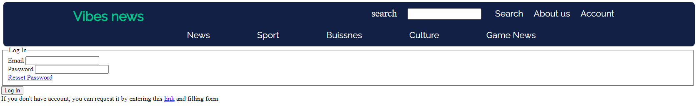

# Jakub Rak
___
## Technology and Skills:

---
## Recent Projects:
## 1. Vibes-News

## 2. Messenger

### Python flask app connected with postgreSQL db through Docker.

### Back-end Python Flask App 
## 3. AuctionSite

### Front-end app based on Vanila JavaScript
