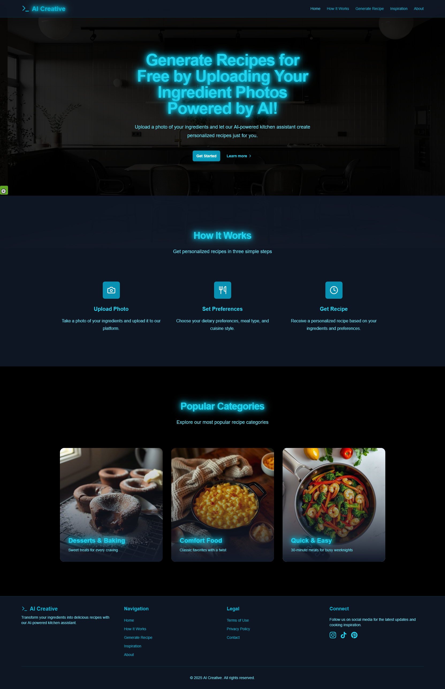
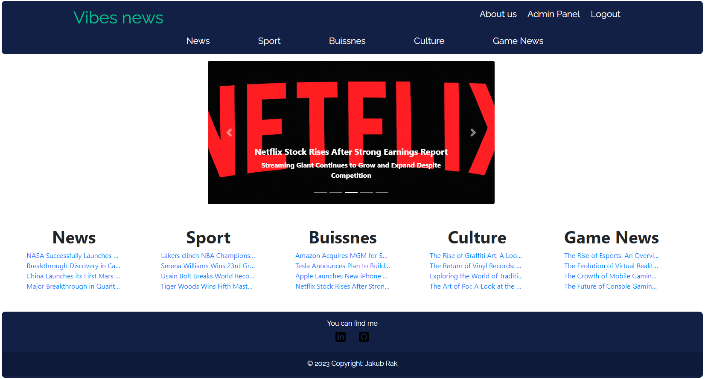

# Jakub Rak
___
## Technology and Skills:

---
## 🚀 Recent Projects

### 1. AI-Creative – AI Recipe Generator  
🔗 [Live Demo](https://aicreative.website) | [📄 Full Documentation](docs/AI-Creative-Documentation.md)

A full-stack web application that uses **AI + Computer Vision** to generate personalized cooking recipes from uploaded food photos.  

**Stack:** Python (Flask), React, Typescript, Vite, Tailwind, [Gemini](https://aistudio.google.com/)/[Pollinations.ai](https://pollinations.ai/)

✅ Key features:
- Upload any food photo → get ingredients + step-by-step recipe  
- Integrated with AI models for image-to-text and recipe generation  
- Live deployed version available online  
- Built with production-ready stack  

🎥 **Project Walkthrough (MP4 Demo)**  

## 2. Vibes-News
### Back-end Python Flask App to manage news articles and users

### Python flask app connected with two postgreSQL db through Docker.

