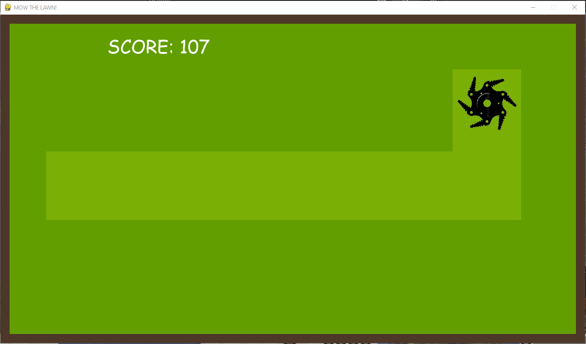
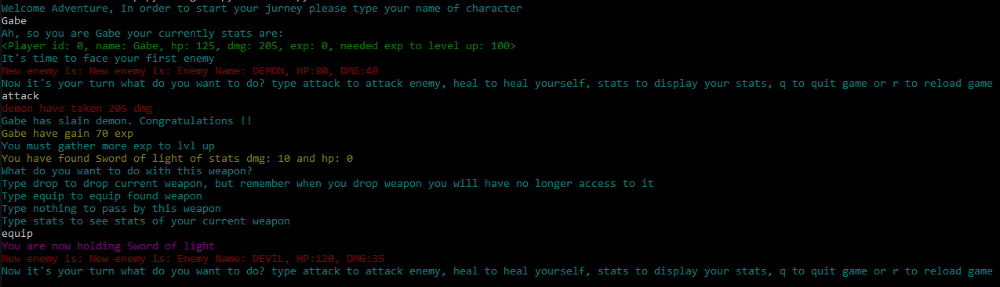

# Jakub Rak
___
## Technology and Skills:

---
## Recent Projects:
## 1. Vibes-News

### Back-end Python Flask App 
## 2. AuctionSite

### Front-end app based on Vanila JavaScript
## 3. Pygame Mow_Lawn

### Pygame script, where user has to mow the lawn by presing keys and move the lawn mover

## 4. Python Game

### Python Script to play in console
